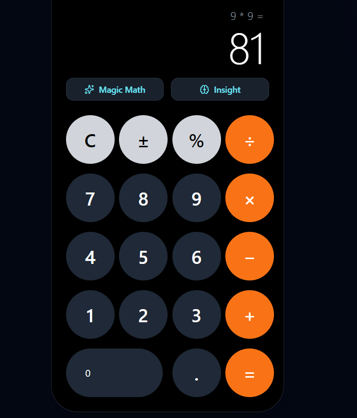

# React AI Calculator

A modern, responsive calculator built with **React** and **Tailwind CSS**, featuring AI-powered calculations and explanations via the Gemini API.

## Features

- Standard arithmetic operations: addition, subtraction, multiplication, division
- Percentage and sign toggle (±)
- Backspace and clear functionality
- Responsive layout for mobile and desktop
- **AI-powered "Magic Math":**
  - Enter natural language math queries
  - Get numeric results instantly
- **AI "Insight":**
  - Fun explanation or math joke about the current result
- Keyboard support for numbers, operations, Enter, Backspace, and Escape

## Screenshots



## Installation

1. Clone the repository:

```bash
git clone https://github.com/bagmitapokhrel/calculator.git
